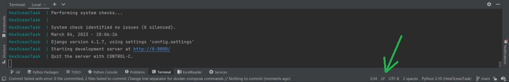

# HEXOCEAN TEST TASK
This is a technical task for the position of Junior Backend Engineer in HexOcean sp. z.o.o.

## Technologies used:


## Setup
* ```git clone https://github.com/OlexiyVasylenkoDev/HexOceanTask.git```
* ```cd HexOceanTask```

To start the programme with docker-compose, you need docker and docker-compose to be installed on your local machine. 
Follow the instructions [here](https://docs.docker.com/compose/install/) to install them on your local machine.

* ```docker-compose up --build```.

If you are having ```exec ./commands/start_celery.sh: no such file or directory```, please go to your code editor and change Line Separator and File Encoding just like here: 



* And that`s it! The project is running!

## How to access API?
Go to your browser and type ```localhost/images``` in the url.

For testing purposes, I have already created superuser with the most unexpected credentials: 
```
Username: admin
Password: admin
``` 
You can use it to login.

### via CURL

* List images: ```curl -X GET http://localhost/list_images/ -u "admin:admin"```
* Upload image: ``` curl -X POST -F "file=@C:\Images\photo.jpg" http://localhost/upload_images/ -u "admin:admin"``` 

```C:\Images\photo.jpg``` here is an example of how path to file should be built.

### via Postman

* Choose POST method and type ```http:localhost://upload_images/``` in request url.
* Go to authorization and write down 'admin' in both username and password.
* Go to body, choose form-data among other options.
* In KEY column select File from dropdown, and in VALUE column click on Select Files and select, which image you would like to upload. Please remember that only '.jpg' and '.png' formats are allowed. And you can upload only one image at a time.

## Remarks
* If you get ```There is no such settings file settings``` while running tests from PyCharm, go to Modify Run Configuration in the panel, where tests are running, select Custom Settings and type path to settings within your local machine. It should look like this: ```HexOceanTask\src\config\settings.py```.
* It is generally considered a bad practice to push the .env file to a repository due to security reasons. But as it is easier to test and as there is no sensitive information in my .env file, I`ve decided to push it. 
* I`ve commented out the admin pages in docker-compose file to make docker-compose starting faster. You could uncomment them and try them out as well if you wish.

